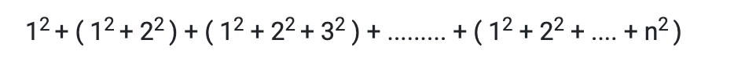

## PPA 1

Complete the program according to the instructions provided in the comments such that the program satisfies the given test cases.

**question**

```
import java.util.*;
class Rectangle{
    int w;    //width
    int h;    //height
//LINE-1: write the function setw(int) to initialize w
	
//LINE-2: write the function seth(int) to initialize h
	
//LINE-3: write the function area() to return area of rectangle
}
public class FClass{
	public static void main(String[] args) {
        Scanner sc= new Scanner(System.in);
        int w = Integer.parseInt(sc.nextLine());
        int h = Integer.parseInt(sc.nextLine());
        Rectangle r = new Rectangle();
        r.setw(w);
        r.seth(h);
        int area = r.area();
        System.out.print(area);
    }
}
```

## Test Case 1

Input
```
10
20
```
Expected Output
```
200
```
## Test Case 2
Input
```
100
50
```
Expected Output
```
5000
```

## Submission Results (private case)
Test Case 1
Input
```
25
4
```
Expected Output
```
100
```

## PPA 2

Write a program to accept a string input from user and print the characters at even indices.

**question**

```
import java.util.*;
class FClass {
  
  public static void main(String[] args){
    Scanner sc = new Scanner(System.in);
    String s1 = sc.next();
    evenDisplay(s1);
  }
//Define evenDisplay(String) method here
}
```

## Test Case 1

Input
```
hii
```
Expected Output
```
hi
```
## Test Case 2
Input
```
Microsoft
```
Expected Output
```

Mcoot
```

## Submission Results (private case)
Test Case 1
Input
```
Generates
```
Expected Output
```

Gnrts
```

Test Case 2
Input
```
pneumonoultramicroscopicsilicovolcanoconiosis

```
Expected Output
```

pemnutairsoislcvlaooiss
```

## GRPA 1

Write a program to find the sum of the following series up to n terms.

**question**

```
import java.util.*;
public class SeriesSum {
  public static void main(String[] args) {
    Scanner sc = new Scanner(System.in);
    int n = sc.nextInt();
//Fill your code here
System.out.println(sum);
    
  }
}
```

## Test Case 1

Input
```
2
```
Expected Output
```
6
```
## Test Case 2
Input
```
3
```
Expected Output
```
20
```

## Submission Results (private case)
Test Case 1
Input
```
34
```
Expected Output
```
124950
```

## GRPA 2


Complete the definition of the given class by defining appropriate constructors and member functions such that it is in coherence with the given main method and produce the required output.
**question**

```
import java.util.Scanner;

class Employee{
	    String ename;
	    String eid;
	    String edept;
	    
	    public Employee(){
		        ename = "guest";
	    }
//Define the required methods
}
public class FClass 
{
	    public static void main(String args[]) 
	    {
		        Scanner s = new Scanner(System.in);
		        Employee e1 = new Employee();
		
		        //Enter name of the employee
		        String name = s.nextLine();
		
		        //Enter id of the employee
		        String id = s.nextLine();
		
		        //Enter department of the employee
		        String dept = s.nextLine();
		
		        Employee e2 = new Employee(name,id,dept);
		
		        e1.copyDept(e2); 
		        //Copies the department name of e2 into e1's department name.
		
		        e1.displayDetails();
	    }
}
```

## Test Case 1

Input
```
Patrick
e005
Production
```
Expected Output
```

e005
Production
ename : guest
eid : null
edept : Production
```
## Test Case 2
Input
```
Gweneth
e009
Marketing
```
Expected Output
```
ename : guest
eid : null
edept : Marketing
```

## Submission Results (private case)
Test Case 1
Input
```
Adam
e008
R/D
```
Expected Output
```
ename : guest
eid : null
edept : R/D
```

## GRPA 3

Complete the definition of the given class by defining appropriate constructors and member functions such that it is in coherence with the given main method and produce the required output
**question**

```
import java.util.*;

class Employee
{
    String eid;
    String ename;
    String eprojects[];
 //Define all the required methods here
public void mutator()
    {
        this.ename = "Mr "+ this.ename;
        this.eprojects[0] = null;
    }
    
}
public class FClass
{
    public static void main(String[] args) 
    {
        Scanner s = new Scanner(System.in);
    	   String project[] = {"P001","P002","P003"};
        //Enter the id of employee
        String id = s.nextLine();
        //Enter the name of employee
        String name = s.nextLine();
        
        Employee e1 = new Employee(id,name,project);
        Employee e2 = new Employee(e1); 
        //The copy constructor must copy all the data members. 
       
        e1.mutator();
        
        e2.display();
    }
}
```

## Test Case 1

Input
```
e005
Patrick
```
Expected Output
```

id:e005
name:Patrick
projects:
P001:P002:P003:
```
## Test Case 2
Input
```
e009
Nadia
```
Expected Output
```
id:e009
name:Nadia
projects:
P001:P002:P003:
```

## Submission Results (private case)
Test Case 1
Input
```
e008
Adams
```
Expected Output
```
id:e008
name:Adams
projects:
P001:P002:P003:
```