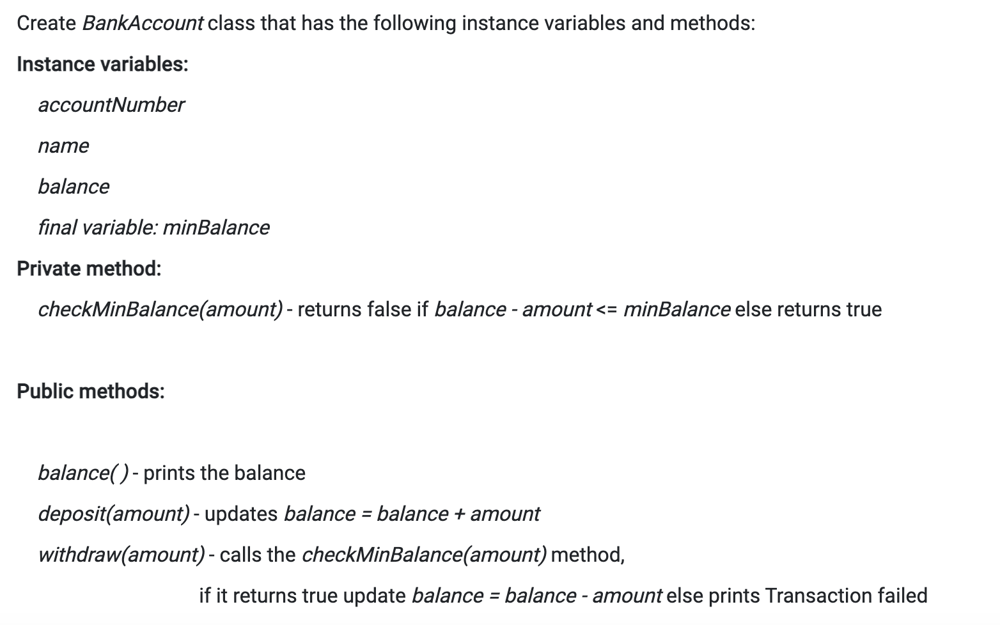

## PPA 1

Write a class named Calculator that has the following methods:
```
    sum(double a, double b) that prints the value of a + b
    subtraction(double a, double b) that prints the value of a - b
    multiply(double a, double b) that prints the value of a * b
    division(double a, double b) that prints the value of a / b
```
Write another class named UpdatedCalculator that inherits all the methods of Calculator and also has the following method:
```
    remainder(double a, double b) that prints the value of a % b
```
**question**

```
import java.util.*;
    class Calculator{
        // Fill the code
   }
   class UpdatedCalculator extends Calculator{
        // Fill the code
} 
    public class CalculatorCheck{
        public static void main(String[] args) {
            Scanner sc = new Scanner(System.in);
            double n1 = sc.nextDouble();
            double n2 = sc.nextDouble();
            Calculator c = new Calculator();
            c.sum(n1, n2);
            c.subtraction(n1, n2);
            c.multiply(n1, n2);
            c.division(n1, n2);
            UpdatedCalculator uc = new UpdatedCalculator();
            uc.remainder(n1, n2);
        }
    
    }
```

## Test Case 1

Input
```
10
5
```
Expected Output
```
15.0
5.0
50.0
2.0
0.0
```
## Test Case 2
Input
```
2
4
```
Expected Output
```
6.0
-2.0
8.0
0.5
2.0
```

## Submission Results (private case)
Test Case 1
Input
```
90
6
```
Expected Output
```
96.0
84.0
540.0
15.0
0.0
```

## PPA 2

Consider the following Java program. 
Implement the code as instructed in the comment, such that it satisfies the given test cases and is in coherence with the given main function.

**question**

```
import java.util.*;
class Point{
    private int x, y;
 // implement the constructor and 
    // override the toString() and equals() methods
}

class FClass{
    public static void main(String[] args) {
        Scanner sc = new Scanner(System.in);
        int x1 = sc.nextInt();
        int y1 = sc.nextInt();
        int x2 = sc.nextInt();
        int y2 = sc.nextInt();
	    
        Point p1 = new Point(x1, y1);
        Point p2 = new Point(x2, y2);
		
        if(p1.equals(p2))
            System.out.println(p1 + "==" + p2);
        else
            System.out.println(p1 + "!=" + p2);
    }
}
```

## Test Case 1

Input
```
10 20 10 20
```
Expected Output
```

(10, 20)==(10, 20)
```
## Test Case 2
Input
```
100 200 300 100
```
Expected Output
```
(100, 200)!=(300, 100)
```

## Submission Results (private case)
Test Case 1
Input
```
211 1 211 1

```
Expected Output
```
(211, 1)==(211, 1)
```


## GRPA 1

Consider the following Java program. 

Implement the code as instructed in the comment, such that it satisfies the given test cases and is in coherence with the given main method
**question**

```
import java.util.*;
class Person{
    private String name;
    private long aadharno;
    public Person(String name, long aadharno){
        this.name = name;
        this.aadharno = aadharno;
    }
    public void print() {
        System.out.println("name : " + name);
        System.out.println("aadharno : " + aadharno);
    }
}

class Employee extends Person{
    private double salary;

    //implement the constructor

    //override print method 
}

class ContactEmployee extends Employee{
    final private static double hourlyPay = 100.00;
    private int contactHour;
	
    //implement the constructor
    //salary is computed as contactHour * hourlyPay  
}

class FClass{
    public static void main(String[] args) {
        Scanner sc = new Scanner(System.in);
        String nm1 = sc.nextLine();
        String nm2 = sc.nextLine();
        long adh1 = sc.nextLong();
        long adh2 = sc.nextLong();
        double sal = sc.nextDouble();
        int cont = sc.nextInt();
        Employee[] eArr = new Employee[2];
        eArr[0] = new Employee(nm1, adh1, sal);
        eArr[1] = new ContactEmployee(nm2, adh2, cont);
        for(Employee e : eArr)
            e.print();
    }
}
```

## Test Case 1

Input
```
Kunal
Bikash
1011101
1022010
30000.00
50
```
Expected Output
```
name : Kunal
aadharno : 1011101
salary : 30000.0
name : Bikash
aadharno : 1022010
salary : 5000.0
```
## Test Case 2
Input
```
Vinay
Prapti
2034012
4201022
50000.00
100
```
Expected Output
```
name : Vinay
aadharno : 2034012
salary : 50000.0
name : Prapti
aadharno : 4201022
salary : 10000.0
```

## Submission Results (private case)
Test Case 1
Input
```
Purnima
Puran
501205
430102
30000.00
15
```
Expected Output
```
name : Purnima
aadharno : 501205
salary : 30000.0
name : Puran
aadharno : 430102
salary : 1500.0
```

## GRPA 2


Consider the following Java program. 
Implement the code as instructed in the comment, such that it satisfies the given test cases.
**question**

```
import java.util.*;
class Shape{
    public int area() {
        return 0;
    }
    public int volume() {
        return 0;
    }
}

class Rectangle extends Shape{
    private int w, h;
//implement Rectangle class
}

class Cube extends Shape{
    private int a;
    //implement Cube class
}

class FClass{
    private static void caller(Shape s) {
        //check if s is of type Rectangle
            System.out.println(s.area());
        //check if s is of type Cube
            System.out.println(s.volume());
    }
public static void main(String[] args) {
        Scanner sc = new Scanner(System.in);
        int w = sc.nextInt();
        int h = sc.nextInt();
        int a = sc.nextInt();
        caller(new Rectangle(w, h));
        caller(new Cube(a));
    }
}
```

## Test Case 1

Input
```
15 8 20
```
Expected Output
```
120
8000
```
## Test Case 2
Input
```
30 20 10
```
Expected Output
```

600
1000
```

## Submission Results (private case)
Test Case 1
Input
```
10 20 30
```
Expected Output
```

200
27000
```

## GRPA 3

**question**

```
import java.util.*;
    class BankAccount{
        int accountNumber;
        String name;
        int balance;
        final int minBalance = 100;
        private boolean checkMinBalance(int amount){
            if(balance - amount <= minBalance){
                return false;
            }
            else{
              return true;
            }
        }
//Fill the code here
}
    class AccountCheck{
        public static void main(String[] args) {
            Scanner sc = new Scanner(System.in);
            int amnt = sc.nextInt( );
            int amnt1 = sc.nextInt( );
            BankAccount b = new BankAccount(1890, "rahul", 1000);
            b.deposit(amnt);
            b.balance();
            b.withdraw(amnt1);
            b.balance();
        }
    
    }
```

## Test Case 1

Input
```
1000
2000
```
Expected Output
```
2000
Transaction failed
2000
```
## Test Case 2
Input
```
100
200
```
Expected Output
```
1100
900
```

## Submission Results (private case)
Test Case 1
Input
```
76490
1230
```
Expected Output
```
77490
76260
```